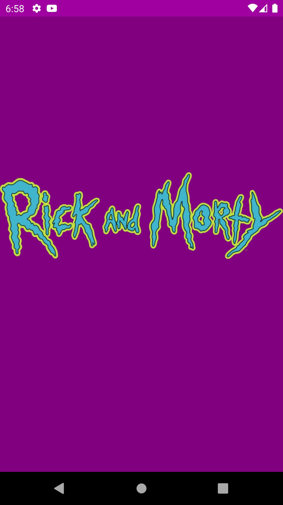

<h1 align="center">MVVM Rick and Morty API</h1>

<h1 align="center">
  
  
  
  
  
  </h1>
  
  <h1 align="center">
   
  </h1>

<h1 align="center">
   
</h1>

### Sobre :book: 
 Um aplicativo que consome a API pública  [ rickandmortyapi.com ] da série Rick And Morty e fornece ao usuário dados sobre os personagens.
 
### Habilidades :star:
- Requisição web com Retrofit;
- Arquitetura MVVM;
- Coroutines e suspend functions;
- Navigation Component;
- Bottom Navigation;

### Tecnologias :rocket:

 - Kotlin 
 - Android Studio
 - Retrofit
 
### Funcionalidades 🛠

- [x] Splash Art;
- [x] Filtrar personagens por status e gênero;
- [x] Filtrar personagens por nome;
- [x] Ícone do App;
- [ ] Modo escuro;

### Autor

Feito por André Esperança!

Contatos :
 

<a href="https://github.com/andreesperanca">
   
 
  
  <a href="https://github.com/andreesperanca" title="">André Esperança</a>
 
